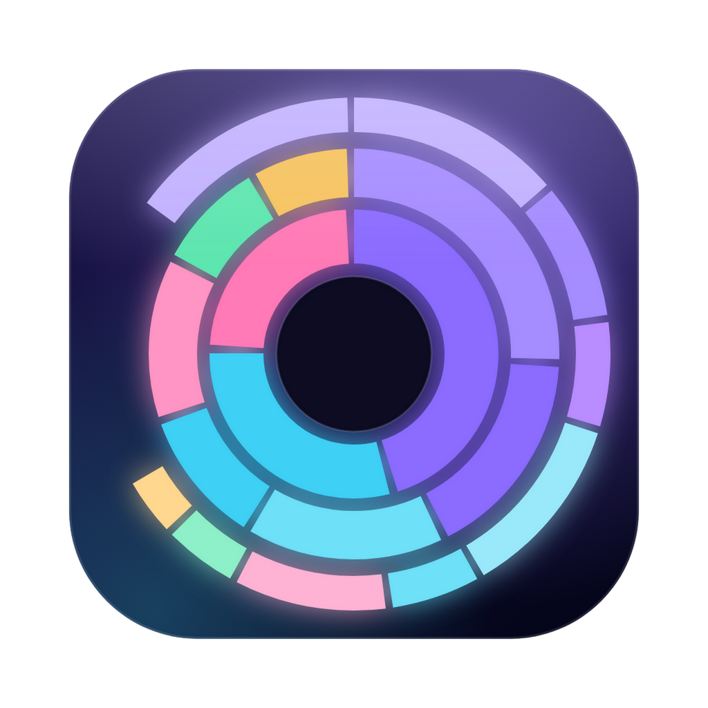
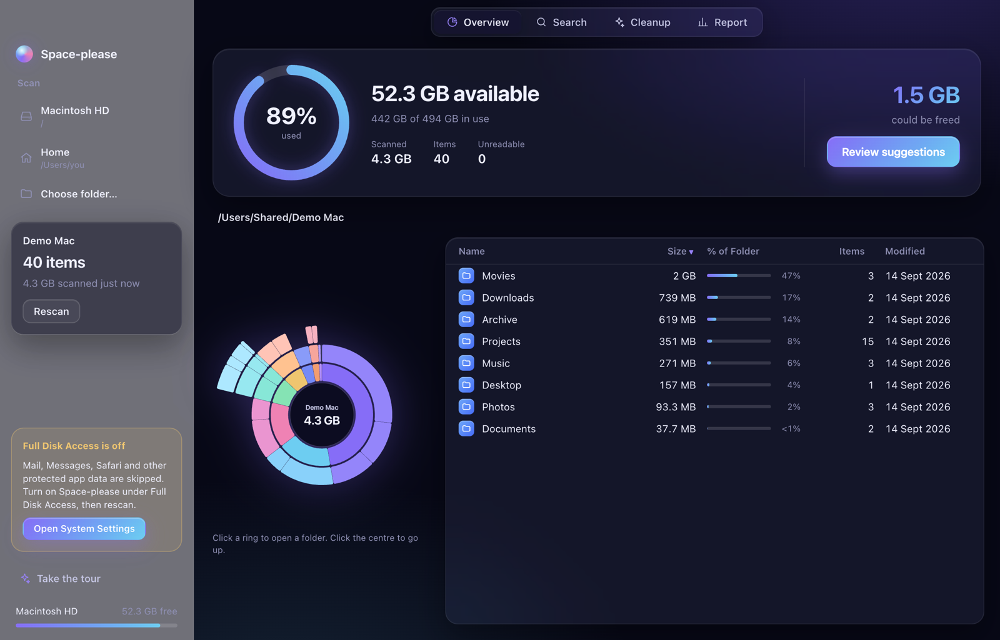
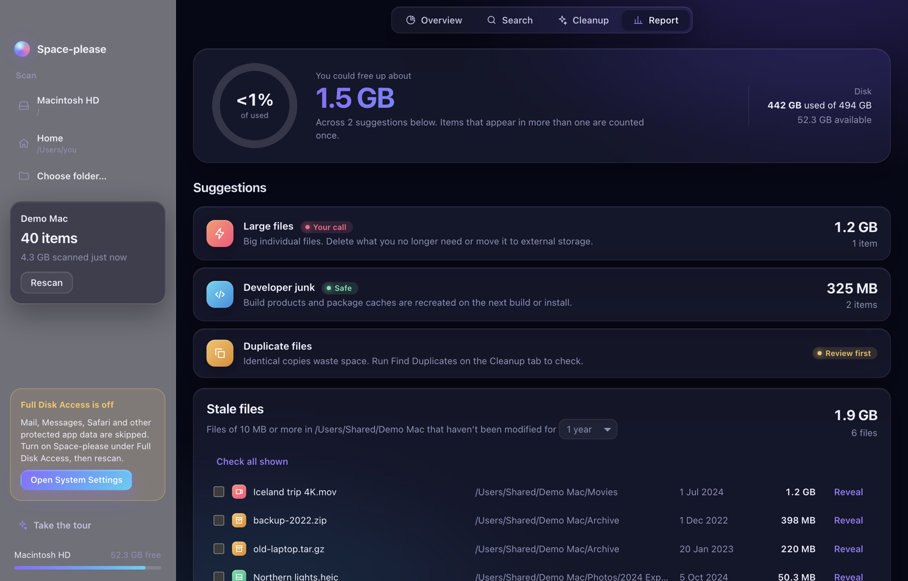
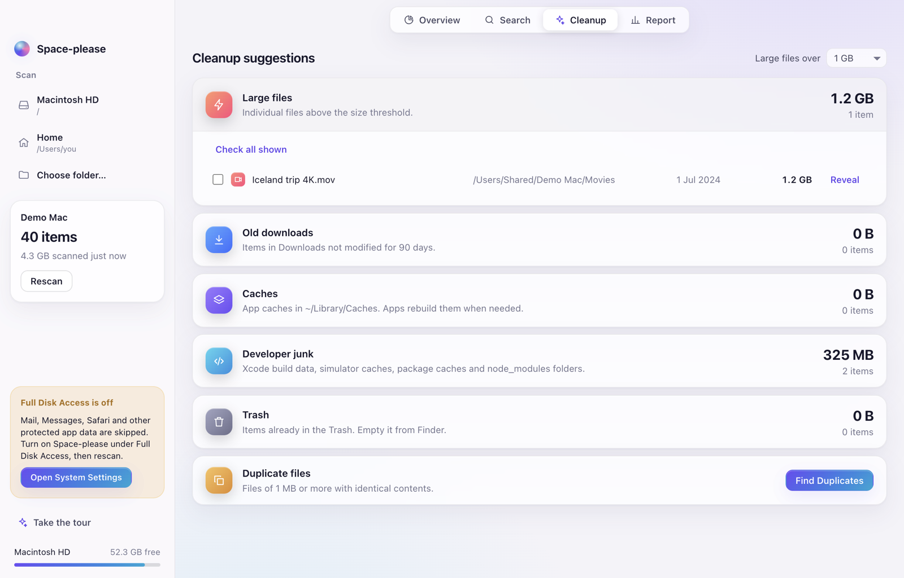
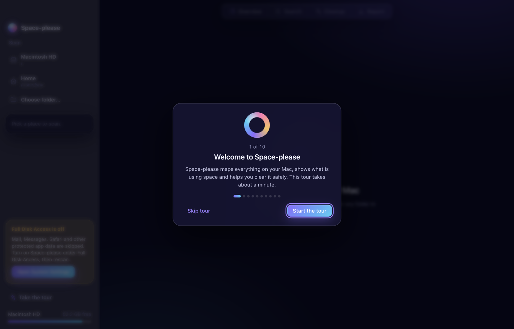
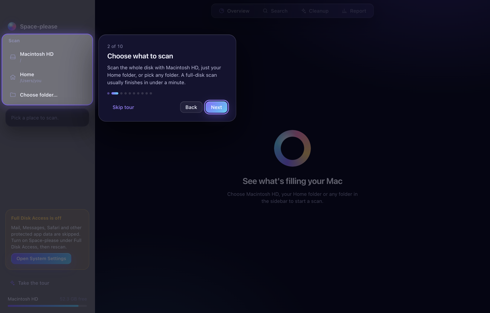
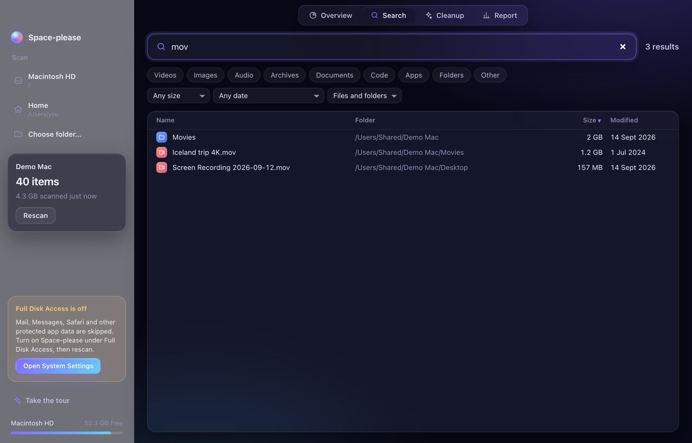
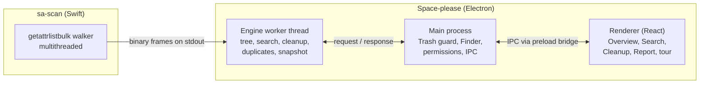

<p align="center">
  
</p>

<h1 align="center">Space-please</h1>

<p align="center">
  <strong>See what's filling your Mac, and free up space safely.</strong><br>
  A fast, private, open-source disk space analyser for macOS.
</p>

<p align="center">
  <a href="https://github.com/Thirumurugan7/Space-please/releases/latest/download/Space-please.dmg"></a>
</p>

<p align="center">
  <a href="https://space-please.vercel.app">Website</a> ·
  <a href="https://github.com/Thirumurugan7/Space-please/releases/latest">Releases</a> ·
  <a href="https://github.com/Thirumurugan7/Space-please/issues">Report an issue</a>
</p>

<p align="center">
  <a href="https://github.com/Thirumurugan7/Space-please/releases/latest"></a>
  
  <a href="LICENSE"></a>
</p>

<p align="center">
  
</p>

---

## Contents

- [What is Space-please?](#what-is-space-please)
- [Features](#features)
- [Requirements](#requirements)
- [Download and install](#download-and-install)
- [First launch](#first-launch)
- [Using Space-please](#using-space-please)
- [Safety and privacy](#safety-and-privacy)
- [Build from source](#build-from-source)
- [How it works](#how-it-works)
- [Project structure](#project-structure)
- [Troubleshooting](#troubleshooting)
- [FAQ](#faq)
- [Contributing](#contributing)
- [License](#license)

## What is Space-please?

Space-please scans your whole Mac, or any folder, and shows you exactly where your storage went. It lists every file it finds, lets you search all of them instantly, draws an interactive sunburst map of your folders, and suggests what you can safely remove, from forgotten downloads and caches to duplicate files and developer junk.

Everything happens on your Mac. Nothing is uploaded, and nothing is ever deleted permanently: items you remove go to the Trash, where you can put them back.

## Features

| | |
|---|---|
| **Fast native scanner** | A multithreaded Swift scanner reads millions of files in seconds. On a MacBook it scanned 5.8 million entries in about 28 seconds. |
| **Overview** | A storage ring shows how full your disk is. Explore folders with a colour-coded sunburst: click a ring to open a folder, click the centre to go back. |
| **Search everything** | Find any file by name across millions of entries, and filter by type (videos, images, archives, apps…), size, date modified, or files and folders. |
| **Cleanup suggestions** | Large files, old downloads, app caches, developer junk (Xcode DerivedData, `node_modules`, package caches), the Trash, and hash-verified duplicate files. |
| **Space-saving report** | How much you could free, suggestions rated *Safe*, *Review first* or *Your call*, stale files you haven't touched in years, and what was added recently. |
| **Safe deletion** | Move to Trash only, with confirmation (twice for more than 10 GB or 500 items). System folders, your Home folder and the app itself are protected. |
| **Guided tour** | A first-launch walkthrough shows every option. Replay it anytime with *Take the tour*. |
| **Remembers your scan** | Your last scan opens instantly next time, so you don't have to rescan to keep exploring. |
| **Beautiful in light and dark** | A glass-styled interface that follows your macOS appearance. |

<p align="center">
  
  
</p>

## Requirements

- **macOS 15 Sequoia or later**
- **A Mac with Apple Silicon** (M1 or newer)
- About 250 MB of free space for the app

## Download and install

1. **Download** [`Space-please.dmg`](https://github.com/Thirumurugan7/Space-please/releases/latest/download/Space-please.dmg) from the [latest release](https://github.com/Thirumurugan7/Space-please/releases/latest).
2. **Open** the downloaded `Space-please.dmg`.
3. **Drag** the Space-please icon onto the **Applications** folder in the window that appears.
4. **Open** Space-please from your Applications folder or Launchpad.

### "Space-please can't be opened" on first launch

Space-please is free and open source, and it isn't signed with a paid Apple Developer certificate, so macOS asks you to confirm the first time you open it. You only need to do this once:

1. Double-click Space-please. When macOS shows the warning, click **Done**.
2. Open **System Settings** → **Privacy & Security**.
3. Scroll down to the message *"Space-please" was blocked to protect your Mac* and click **Open Anyway**.
4. Enter your password if asked, then click **Open Anyway** again.

<details>
<summary>Prefer the Terminal?</summary>

After copying the app to Applications, run:

```bash
xattr -dr com.apple.quarantine /Applications/Space-please.app
```

Then open Space-please normally.
</details>

### Updating

Download the newest `Space-please.dmg` and drag the app into Applications again, choosing **Replace**. Your last scan is kept.

### Uninstalling

Drag **Space-please** from Applications to the Trash. To remove its saved scan as well, delete `~/Library/Application Support/Space-please`.

## First launch

1. **Take the guided tour.** It starts automatically the first time and walks through choosing what to scan, Full Disk Access, and each tab. Skip it anytime, and replay it later from **Take the tour** in the sidebar.
2. **Allow Full Disk Access (recommended).** macOS protects some folders, such as Mail, Messages and Safari data. For complete results:
   1. Open **System Settings** → **Privacy & Security** → **Full Disk Access**.
   2. Turn on **Space-please** (use the **+** button to add it from Applications if it isn't listed).
   3. Quit and reopen Space-please, then scan again.

   Without Full Disk Access, Space-please still works; protected folders are simply skipped and counted as *unreadable*. The sidebar shows a reminder with an **Open System Settings** button.
3. **Choose what to scan** in the sidebar:
   - **Macintosh HD**: your entire disk (usually under a minute)
   - **Home**: just your user folder
   - **Choose folder…**: any folder or external drive

   macOS may ask for permission to read your Desktop, Documents or Downloads folders. Click **Allow**.

<p align="center">
  
  
</p>

## Using Space-please

### Overview

- The **storage ring** shows how much of your disk is used and how much is available. **Review suggestions** jumps to the Report.
- The **sunburst** maps folders by size. Hover to see a folder's size, click a ring to open it, and click the centre to go up. The breadcrumb above it shows where you are.
- The **table** lists the current folder's contents, biggest first, with each item's share of the folder. Click a column header to sort. Double-click a folder to open it, or a file to open it in its app.

### Search

Type in **Search all files** to find anything by name, even among millions of files. Narrow the results with the type chips (Videos, Images, Audio, Archives, Documents, Code, Apps, Folders, Other) and the size, date and kind menus. Leave the search empty to list everything, biggest first.

<p align="center"></p>

### Cleanup

Expand a category to see its items, tick what you don't need, and click **Move to Trash**.

| Category | What it finds |
|---|---|
| Large files | Individual files above a size you choose (100 MB, 500 MB, 1 GB or 5 GB) |
| Old downloads | Items in Downloads not modified for 90 days |
| Caches | App caches in `~/Library/Caches`, which apps rebuild when needed |
| Developer junk | Xcode DerivedData and Archives, simulator caches, Gradle, npm and Homebrew caches, and `node_modules` folders |
| Trash | What's already in the Trash. **Open Trash** takes you there to empty it |
| Duplicate files | Files of 1 MB or more with identical contents, confirmed by SHA-256 hashing. **Keep Newest** or **Keep Oldest** ticks the extra copies for you |

### Report

- **You could free up about…** adds up every suggestion, counting items that appear in more than one category only once.
- **Suggestions** are ranked by size and rated:
  - **Safe**: caches, build data, the Trash
  - **Review first**: old downloads, duplicates
  - **Your call**: large personal files
- **Stale files** lists files of 10 MB or more not modified for 1, 2 or 3 years.
- **Recently added** lists files of 1 MB or more modified in the last 7 or 30 days, so you can see what has been eating space lately.

### Acting on files

Right-click any row for **Open**, **Reveal in Finder**, **Copy Path** and **Move to Trash**. Select several rows with ⌘-click or ⇧-click, then use the action bar at the bottom.

## Safety and privacy

- **Nothing is deleted permanently.** Every removal uses the macOS Trash, so you can put items back from Finder.
- **Protected locations.** `/`, `/System`, `/usr`, `/bin`, `/sbin`, `/Library/Apple`, the folder you scanned, your Home folder and Space-please itself can't be moved to the Trash, even by accident.
- **Confirmation first.** You always see what you're about to remove and its total size, with a second confirmation for large removals.
- **Private by design.** Space-please makes no network requests, has no analytics and no account. Scan results stay in `~/Library/Application Support/Space-please` on your Mac.
- **Read-only scanning.** The scanner only reads file metadata (names, sizes, dates); it never opens your files, except to compare possible duplicates when you ask it to.

## Build from source

### Prerequisites

| Tool | Version | Install |
|---|---|---|
| macOS | 15 or later, Apple Silicon | |
| Xcode or Command Line Tools | Swift 6.x | `xcode-select --install`, or install Xcode from the App Store |
| Node.js | 24.21.0 (see `.nvmrc`) | [nvm](https://github.com/nvm-sh/nvm): `nvm install && nvm use` |
| Git | any recent | included with Command Line Tools |

JavaScript dependencies (installed by npm, pinned in `app/package.json`): Electron 44, electron-vite 5, Vite 7, React 19, TypeScript 5.9, Vitest 5, Playwright 1.63, d3-hierarchy and d3-shape, @tanstack/react-virtual, and electron-builder 26.

### Get the code and run it

```bash
git clone https://github.com/Thirumurugan7/Space-please.git
cd Space-please
nvm install && nvm use          # Node 24.21.0
npm install --prefix app        # JavaScript dependencies
npm run dev                     # builds the Swift scanner, then opens the app with hot reload
```

### Test

```bash
npm test          # Swift scanner tests + unit tests
npm run e2e       # end-to-end test: launches the app, runs the tour, scans, searches and trashes a test file
```

### Package the installer

```bash
npm run build     # builds the scanner and app, then creates app/dist/Space-please.dmg
```

The DMG is unsigned. To sign and notarise it, add your Developer ID settings to the `build.mac` section of `app/package.json` (see the [electron-builder code signing guide](https://www.electron.build/code-signing)).

### npm scripts

| Command (repo root) | What it does |
|---|---|
| `npm run dev` | Build the scanner and start the app in development mode |
| `npm test` | Run the Swift tests and all unit tests |
| `npm run e2e` | Build the app and run the Playwright end-to-end test |
| `npm run build` | Create `app/dist/Space-please.dmg` |
| `npm run scanner:build` | Build only the release scanner binary |
| `npm run scanner:test` | Run only the Swift scanner tests |

Inside `app/` there are also `npm run typecheck`, `npm test`, `npm run build` (bundle only) and `npm run dist:dir` (unpacked `.app` without a DMG).

## How it works



1. **Scanner.** `sa-scan` walks the disk with the macOS `getattrlistbulk` system call on several threads. It streams compact binary records (id, parent, kind, allocated size, modification time, name), skips other volumes and symlinks, and counts hard links once.
2. **Engine.** A Node worker thread turns the stream into a columnar in-memory tree built for millions of entries. It rolls up folder sizes and keeps a lowercase name index for instant search. It also answers the Overview, Search, Cleanup and Report queries, finds duplicates, and saves a snapshot so the last scan opens instantly.
3. **Main process.** It handles everything that touches your files: resolving ids to paths, the protected-path guard, Move to Trash, Reveal in Finder, and the Full Disk Access check.
4. **Renderer.** A sandboxed React interface (`contextIsolation`, no Node access, strict Content Security Policy). It only ever requests the rows currently on screen.

## Project structure

```
Space-please/
├── scanner/                 Swift package: sa-scan CLI and ScannerCore library (+ XCTest)
├── app/
│   ├── build/icon.png       App icon
│   ├── src/
│   │   ├── engine/          Frame parser, tree, queries, cleanup, report, duplicates, snapshot, worker
│   │   ├── main/            Electron main process: IPC, Trash guard, system probes
│   │   ├── preload/         Secure bridge exposing window.sa
│   │   ├── renderer/        React UI: tabs, components, guided tour, styles
│   │   └── shared/          Types and IPC contracts shared across processes
│   ├── test/                Vitest unit tests
│   └── e2e/                 Playwright end-to-end test
├── website/                 Static project website
├── docs/screenshots/        Images used in this README
└── package.json             Root scripts
```

## Troubleshooting

**macOS says the app can't be opened or is damaged.**
Follow [the first-launch steps](#space-please-cant-be-opened-on-first-launch). If macOS says the app is *damaged*, run `xattr -dr com.apple.quarantine /Applications/Space-please.app`.

**Some folders are missing or the scan shows many unreadable items.**
Grant Full Disk Access (see [First launch](#first-launch)), quit and reopen the app, then rescan.

**The app doesn't open on my Intel Mac.**
Release builds currently target Apple Silicon only. You can build from source on an Intel Mac, but it isn't tested yet.

**I want to see the guided tour again.**
Click **Take the tour** at the bottom of the sidebar.

**I want to start fresh.**
Quit Space-please and delete `~/Library/Application Support/Space-please`. This removes the saved scan and shows the tour again.

**Development: `npm run dev` fails with a Swift error.**
Make sure Xcode or the Command Line Tools are installed (`xcode-select --install`) and that `swift --version` reports Swift 6.

**Development: tests fail on Node 23.**
Use Node 24.21.0: `nvm install && nvm use`.

## FAQ

**Is Space-please free?**
Yes. It's open source under the MIT licence.

**Does it upload anything?**
No. It has no network access, analytics or accounts.

**Can it delete the wrong thing?**
Nothing happens without your confirmation, items only go to the Trash (so they can be restored), and critical system locations are blocked.

**Does it work on Windows or Linux?**
Not yet. The interface and engine are cross-platform, but the scanner uses a macOS-only system call. Contributions to add a cross-platform scanner are welcome.

**Why is the size different from Finder's?**
Space-please reports the space files actually occupy on disk (allocated size) and counts hard-linked files once, using decimal units like Finder. Small differences come from purgeable space, APFS clones and folders you can't read without Full Disk Access.

## Contributing

Bug reports, ideas and pull requests are welcome.

1. Fork the repository and create a branch.
2. Make your change with tests (`npm test` and `npm run e2e` should pass).
3. Open a pull request describing what changed and why.

Please open an issue first for large changes so we can agree on the approach.

## License

[MIT](LICENSE) © 2026 Thirumurugan Sivalingam
